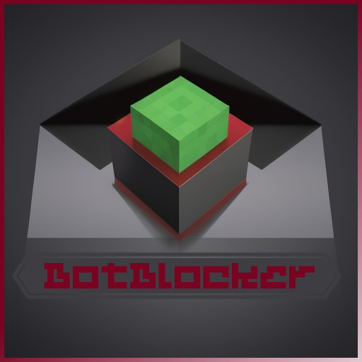

<!-- Improved compatibility of back to top link: See: https://github.com/othneildrew/Best-README-Template/pull/73 -->
<a name="readme-top"></a>

[![Contributors][contributors-shield]][contributors-url]
[![Forks][forks-shield]][forks-url]
[![Stargazers][stars-shield]][stars-url]
[![Issues][issues-shield]][issues-url]
[![MIT License][license-shield]][license-url]
[![LinkedIn][linkedin-shield]][linkedin-url]


<!-- PROJECT LOGO -->
<br />
<div align="center">
  <a href="https://github.com/BotBlocker-Minecraft/BotBlocker">
    
  </a>

  <h3 align="center">BotBlocker</h3>

  <p align="center">
    A Minecraft Bukkit/Spigot plugin and Fabric mod designed to limit bot intrusion!
    <br />
    <a href="https://github.com/BotBlocker-Minecraft/BotBlocker"><strong>Explore the docs »</strong></a>
    <br />
    <br />
    <a href="https://github.com/BotBlocker-Minecraft/BotBlocker/issues">Report Bug</a>
    ·
    <a href="https://github.com/BotBlocker-Minecraft/BotBlocker/issues">Request Feature</a>
  </p>
</div>


<!-- TABLE OF CONTENTS -->
<details>
  <summary>Table of Contents</summary>
  <ol>
    <li><a href="#about-the-project">About The Project</a>
      <ul>
        <li><a href="#built-with">Built With</a></li>
      </ul>
    </li>
    <li><a href="#versions-of-the-project">Versions of the Project</a></li>
    <li>
      <a href="#functionality">Functionality</a>
      <ul>
        <li><a href="#initialization">Initialization</a></li>
        <li><a href="#player-join">Player Join</a></li>
        <li><a href="#player-quit">Player Quit</a></li>
        <li><a href="#commands">Commands</a></li>
        <li><a href="#permissions">Permissions</a></li>
        <li><a href="#configuration-files">Configuration Files</a></li>
      </ul>
    </li>
    <li>
      <a href="#getting-started">Getting Started</a>
      <ul>
        <li><a href="#prerequisites">Prerequisites</a></li>
        <li><a href="#installation">Installation</a></li>
      </ul>
    </li>
    <li><a href="#usage">Usage</a></li>
    <li><a href="#compiling-this-plugin">Compiling this plugin</a></li>
    <li><a href="#contributing">Contributing</a></li>
    <li><a href="#license">License</a></li>
    <li><a href="#contact">Contact</a></li>
    <li><a href="#acknowledgments">Acknowledgments</a></li>
  </ol>
</details>


<!-- ABOUT THE PROJECT -->
## About The Project

BotBlocker is a solution for Minecraft servers designed to limit bot intrusion. It is available for both Bukkit/Spigot Minecraft servers and as a Fabric mod. If a user logs out too quickly after joining (indicating they might be a bot), the user is banned. This approach limits the number of login attempts from each UUID, effectively mitigating the consequences of a bot attack.

### Built With

* 
* [Bukkit/Spigot](https://www.spigotmc.org)

<p align="right">(<a href="#readme-top">back to top</a>)</p>


## Versions of the Project
[Bukkit/Spigot BotBlocker](https://github.com/BotBlocker-Minecraft/BotBlocker)

[Fabric BotBlocker](https://github.com/BotBlocker-Minecraft/BotBlocker-Fabric)

<p align="right">(<a href="#readme-top">back to top</a>)</p>


## Functionality

### Initialization
When the server starts, BotBlocker initializes its configuration files (`config.yml` and `players.yml`). The initial default time limit for joining and leaving is set to 5 seconds. A message indicating the mod has successfully loaded with the set time limit is logged to the console.

### Player Join
When a player joins, if BotBlocker is enabled and the player is not already exempt from BotBlocker's checks, the mod/plugin records the player's UUID and the current time.

### Player Quit
When a player quits, BotBlocker calculates the duration of their connection. If this time is less than the set time limit and BotBlocker is enabled, the player is considered a bot. They get banned and a ban entry is added to the `players.yml` file. A disconnect message is sent to the player and a message is logged to the console. If the player stays longer than the time limit, they are deemed a legitimate player. Their UUID is added to the `players.yml` file as exempt.

### Commands
* `/BotBlocker enable` - Enable the BotBlocker plugin.
* `/BotBlocker disable` - Disable the BotBlocker plugin.
* `/BotBlocker status` - Show wether BotBlocker is enabled or disabled.
* `/BotBlocker setTimeLimit [seconds]` - Set the time limit for detecting bots. Default is 5 seconds.
* `/BotBlocker getTimeLimit` - Display the configured time limit for detecting bots.
* `/BotBlocker setBanMessage [message]` - Set the ban message.
* `/BotBlocker getBanMessage` - Display the configured ban message.

### Permissions
* `botblocker.enable` - Allows the user to enable the BotBlocker plugin
* `botblocker.disable` - Allows the user to disable the BotBlocker plugin.
* `botblocker.status` - Allows the user to see whether BotBlocker is enabled or disabled.
* `botblocker.settimelimit` - Allows the user to set the time limit for detecting bots.
* `botblocker.gettimelimit` - Allows the user to display the configured time limit for detecting bots.
* `botblocker.setbanmessage` - Allows the user to set the ban message.
* `botblocker.getbanmessage` - Allows the user to display the configured ban message.

### Configuration Files
BotBlocker maintains its configuration and the list of player UUIDs in `config.yml` and `players.yml` files, respectively.

> [!NOTE]
> Players identified as legitimate are marked as such in the `players.yml` file and are not checked again in the future. If BotBlocker is disabled, it stops checking players for potential bot activity.

<p align="right">(<a href="#readme-top">back to top</a>)</p>


<!-- GETTING STARTED -->
## Getting Started

To get this plugin up and running on your server, follow these steps:

### Prerequisites

* Java 18 or later
* A Bukkit/Spigot server

### Installation

1. Download the latest BotBlocker `.jar` file from the [releases page](https://github.com/BotBlocker-Minecraft/BotBlocker/releases).
2. Move the downloaded `.jar` file to the `plugins/` directory in your server.
3. Restart your server. This will generate a default configuration file.

<p align="right">(<a href="#readme-top">back to top</a>)</p>


<!-- USAGE EXAMPLES -->
## Usage

Once installed and enabled, BotBlocker works in the background without any intervention. If needed, you can adjust the bot protection parameters in the generated `config.yml` file.

<p align="right">(<a href="#readme-top">back to top</a>)</p>


## Compiling this plugin
To compile BotBlocker for Bukkit/Spigot yourself, follow these steps:

1. Make sure you have Maven installed on your system. You can download it from https://maven.apache.org/download.cgi and find installation instructions at https://maven.apache.org/install.html.

2. Clone this repository.

3. Open your terminal or command prompt.

4. Navigate to the root directory of the cloned repository.

   ```
   cd path/to/BotBlocker
   ```

5. Execute the Maven build command:

   ```
   mvn clean package
   ```

   - The `clean` command will remove any previous build outputs to ensure a fresh build.
   - The `package` command will compile your code and package it into a JAR file.

6. After the build completes, you can find the compiled JAR file in the `target` directory of the project.

7. The JAR file will be named following the convention `BotBlocker-M.m.p.jar`, where `M.m.p` is the version number following [Semantic Versioning](https://semver.org/).

8. You can now deploy this JAR file to your Bukkit/Spigot server's `plugins` folder.


<!-- CONTRIBUTING -->
## Contributing

Contributions are what make the open source community such an amazing place to learn, inspire, and create. Any contributions you make are **greatly appreciated**.

If you have a suggestion that would make this better, please fork the repo and create a pull request. You can also simply open an issue with the tag "enhancement".
Don't forget to give the project a star! Thanks again!

1. Fork the Project
2. Create your Feature Branch (`git checkout -b feature/AmazingFeature`)
3. Commit your Changes (`git commit -m 'Add some AmazingFeature'`)
4. Push to the Branch (`git push origin feature/AmazingFeature`)
5. Open a Pull Request

<p align="right">(<a href="#readme-top">back to top</a>)</p>


<!-- LICENSE -->
## License

Distributed under the GNU General Public License v3.0. See `LICENSE` for more information.

<p align="right">(<a href="#readme-top">back to top</a>)</p>


<!-- CONTACT -->
## Contact

Aitor Astorga Saez de Vicuña - a.astorga.sdv@gmail.com

Project Link: [https://github.com/BotBlocker-Minecraft](https://github.com/BotBlocker-Minecraft)

<p align="right">(<a href="#readme-top">back to top</a>)</p>


<!-- ACKNOWLEDGMENTS -->
## Acknowledgments
* [https://github.com/othneildrew/Best-README-Template](https://github.com/othneildrew/Best-README-Template)

<p align="right">(<a href="#readme-top">back to top</a>)</p>


<!-- MARKDOWN LINKS & IMAGES -->
<!-- https://www.markdownguide.org/basic-syntax/#reference-style-links -->
[contributors-shield]: https://img.shields.io/github/contributors/BotBlocker-Minecraft/BotBlocker.svg?style=for-the-badge
[contributors-url]: https://github.com/BotBlocker-Minecraft/BotBlocker/graphs/contributors

[forks-shield]: https://img.shields.io/github/forks/BotBlocker-Minecraft/BotBlocker.svg?style=for-the-badge
[forks-url]: https://github.com/BotBlocker-Minecraft/BotBlocker/network/members

[stars-shield]: https://img.shields.io/github/stars/BotBlocker-Minecraft/BotBlocker.svg?style=for-the-badge
[stars-url]: https://github.com/BotBlocker-Minecraft/BotBlocker/stargazers

[issues-shield]: https://img.shields.io/github/issues/BotBlocker-Minecraft/BotBlocker.svg?style=for-the-badge
[issues-url]: https://github.com/BotBlocker-Minecraft/BotBlocker/issues

[license-shield]: https://img.shields.io/github/license/BotBlocker-Minecraft/BotBlocker.svg?style=for-the-badge
[license-url]: https://github.com/BotBlocker-Minecraft/BotBlocker/blob/master/LICENSE

[linkedin-shield]: https://img.shields.io/badge/-LinkedIn-black.svg?style=for-the-badge&logo=linkedin&colorB=555
[linkedin-url]: https://linkedin.com/in/aitor-astorga-saez-de-vicuña

[product-screenshot]: images/screenshot.png
